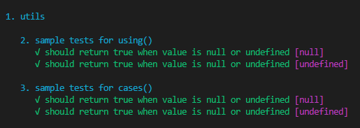

# jasmine-test-cases

_Parametrized unit tests for [Jasmine](https://jasmine.github.io/). Requires Jasmine >=3.1_

## Installation

```sh
npm install --save-dev jasmine jasmine-test-cases
```

## Example

```typescript
import { Utils } from './utils';

describe('Utils', () => {
    describe('isEmpty', () => {
        using(null).
        using(undefined).
            it('should return true when value is null or undefined', value => {
                const result = Utils.isEmpty(value);
                expect(result).toBe(true);
            });
    });
});
```



## Setup (single file)

Import jasmine-test-cases into your test file:

```javascript
const using = require('jasmine-test-cases'); // javascript
```

```typescript
import { using } from 'jasmine-test-cases'; // typescript
```

## Setup (global - common)

You can register jasmine-test-cases **globally**:

```sh
jasmine --helper=node_modules/jasmine-test-cases/register.js src/**/*.spec.js
```

This will register global `using()` function that can be used in any test file passed to jasmine.

When using typescript, you need to update `tsconfig.json` file and add:

```json
    "files": [
      "node_modules/jasmine-test-cases/register.d.ts"
    ]
```

to register typings for the global `using()` function.

## Setup (global - Angular)

Angular requires slightly different approach to registering `using()` function **globally**:

1. Edit `src/test.ts` and add the following dependency at top:

   ```typescript
   import 'jasmine-test-cases/register';
   ```

- (Angular 6): Edit `src/tsconfig.spec.json` and update the files section:

   ```js
   "files": [
    "../node_modules/jasmine-test-cases/register.d.ts",
    // ... other global files
   ]
   ```
- (Angular 8): Edit `tsconfig.spec.json` and update the files section:

   ```js
   "files": [
    "node_modules/jasmine-test-cases/register.d.ts",
    // ... other global files
   ]
   ``` 

Thats it. Now you can run `ng test` and enjoy parametrized tests in angular.

## Usage

There are two styles you can use to parametrize your unit tests:

> `using(...)`

```javascript
// multiple arguments
using(arg1, arg2, arg3, ...). // 1st test case
using(arg4, arg5, arg6, ...). // 2nd test case
    it('expectation', (value1, value2, value3, ...[, done]) => { });
// single argument
using(arg1).
using(arg2).
    it('expectation', function(value[, done]) { });
```

or the above can be rewritten with:

> `using.cases(...)`

```javascript
// multiple arguments
using.cases(
    [arg1, arg2, arg3, ...], // 1st test case
    [arg4, arg5, arg6, ...]  // 2nd test case
).
    it('expectation', (value1, value2, value3, ...[, done]) => { });
// single argument
using.cases(arg1, arg2). // 1st and 2nd test case
    it('expectation', function(value[, done]) { });
```

### Basic parametrized test

Prepend `it` statements with `using` and pass argument to assertions:

```javascript
using(1).
    it('should be one', value => {
        expect(value).toBe(1);
    });
```

The result will display as:

```
√ should be one [1]
```
### Multiple test cases

Chain `using` to create multiple test cases:

```javascript
using('a').
using('b').
using('c').
    it('should be a string', value => {
        expect(value).toBeString();
    });
```

or:

```javascript
using.cases('a', 'b', 'c').
    it('should be a string', value => {
        expect(value).toBeString();
    });
```

The result will display as:

```
√ should be a string ["a"]
√ should be a string ["b"]
√ should be a string ["c"]
```

### Multiple arguments

Pass multiple arguments to `using` and use them in `it` statements:

```javascript
using(1, 'bus').
using(2, 'cars').
    it('should be a number followed by a string', (amount, title) => {
        expect(amount + ' ' + title).toMatch(/^[0-9]\s[a-z]+$/);
    });
```

or

```javascript
using.cases(
    [1, 'bus'],
    [2, 'cars']
).
it('should be a number followed by a string', (amount, title) => {
    expect(amount + ' ' + title).toMatch(/^[0-9]\s[a-z]+$/);
});
```

The result will display as:

```
√ should be a number followed by a string [1, "bus"]
√ should be a number followed by a string [2, "cars"]
```

Please note that the number of arguments per test case must be the same. Otherwise `using` or `using.cases` will throw an error. For example the following will fail:

```javascript
using(1, 'bus').using(2).it('a', n => { });
// ^^^ WILL THROW AN ERROR ^^^
```

## Async

Add the `done` argument at the end of argument list in `it` statements:

```javascript
using(1, 'bus').
using(2, 'cars').
    it("should be a number followed by a string", (amount, title, done) => {
        expect(amount + ' ' + title).toMatch(/^[0-9]\s[a-z]+$/);
        done();
    });
```

## Timeout

Custom timeout for async spec works the same way as regular [it()](https://jasmine.github.io/api/3.0/global#it). Just add another parameter to define the timeout:

```javascript
using(null).
using(undefined).
    it("should be empty", (value, done) => {
        expect(value).not.toBe(true);
        done();
    }, 50);
```


## License

MIT